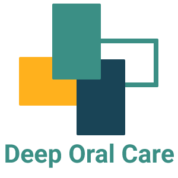

# OralCancerAI: Deep Learning and Knowledge Graph-Based Application



## About

OralCancerAI is an innovative application designed to enhance oral cancer diagnosis and medical training by leveraging cutting-edge deep learning models and the knowledge graph PrimeKG. This README provides an overview of the project, how to set it up, and a basic demo to get you started.

## Table of Contents
- [About](#about)
- [Getting Started](#getting-started)
  - [Prerequisites](#prerequisites)
  - [Installation](#installation)
- [Usage](#usage)
  - [Demo](#demo)
- [Contributing](#contributing)
- [License](#license)
- [Acknowledgments](#acknowledgments)

## Getting Started

### Prerequisites

Before you begin, ensure you have met the following requirements:

- [Python](https://www.python.org/downloads/) (>=3.6)
- [Django Web Framework](https://www.djangoproject.com/download/)
- [Redis](https://redis.io/download)

### Installation

To set up OralCancerAI, follow these steps:

1. Clone the repository:

   ```bash
   git clone https://github.com/wasit7/DeepOralCare.git
   ```

2. Install Python dependencies:

   ```bash
   pip install -r requirements.txt
   ```

3. Configure your Django settings, including database and PrimeKG integration.

4. Migrate the database:

   ```bash
   python manage.py migrate
   ```

5. Start the development server:

   ```bash
   python manage.py runserver
   ```

Now, OralCancerAI should be up and running locally.

## Usage

### Demo

To see the application in action, follow these steps:

1. Access the web interface by opening a web browser and navigating to `http://localhost:8000`.

2. Sign in with your credentials or create a new account.

3. Explore the application's features, including image-based oral cancer detection and knowledge graph-driven insights into risk factors.

4. Upload sample oral cancer images to test the deep learning model's accuracy.

## Contributing

We welcome contributions from the community. If you'd like to contribute to OralCancerAI, please follow our [contribution guidelines](CONTRIBUTING.md).

## License

This project is licensed under the [MIT License](LICENSE).

## Acknowledgments

- The [Health Systems Research Institute (HSRI)](https://www.hsri.or.th/) for providing research grant HSRI-65-025.
- The PrimeKG development team for their invaluable knowledge graph resource.
- Our research participants who provided valuable feedback during the evaluation.
